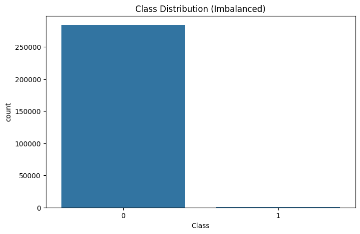
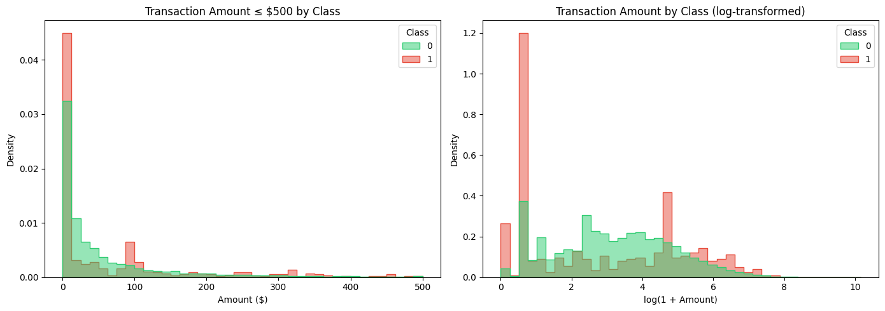
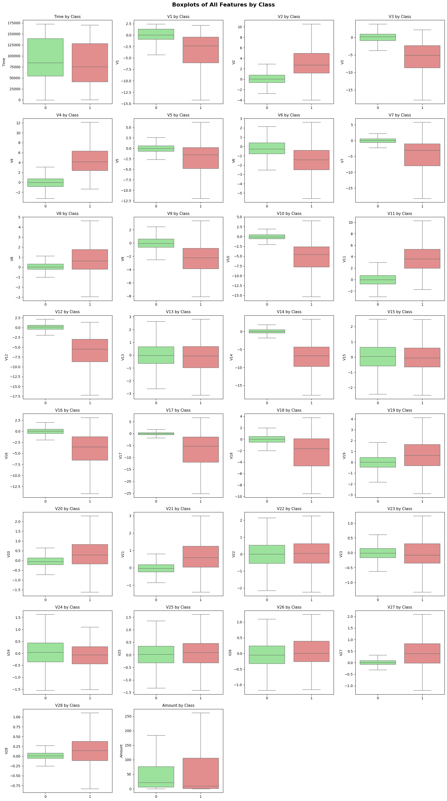
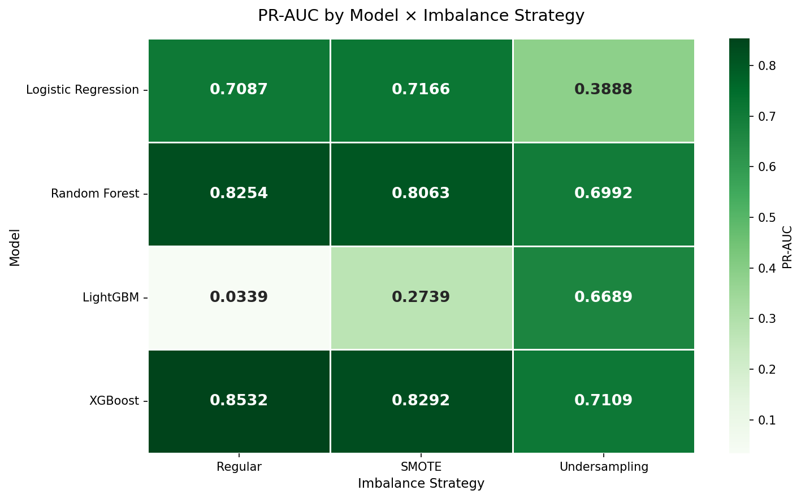
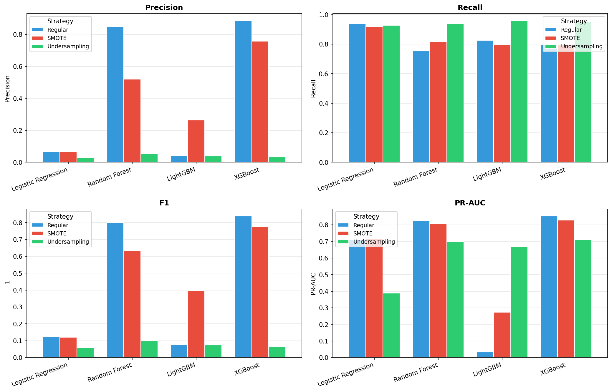
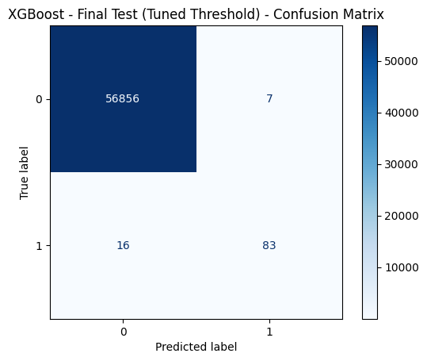
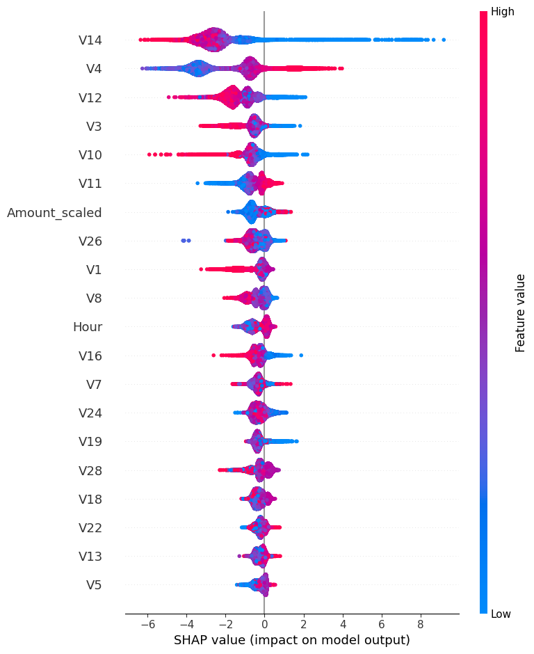
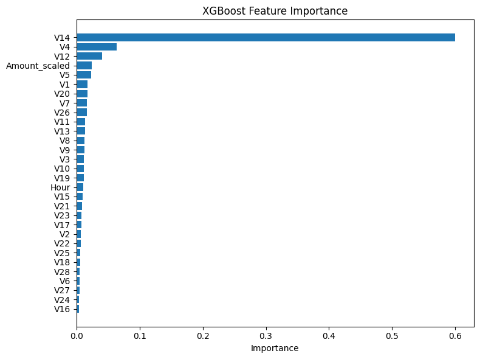

# Credit Card Fraud Detection (CCFD)

This project builds and compares machine learning models that detect fraudulent credit card
transactions. Working from the classic [Kaggle "Fraud Detection" dataset](https://www.kaggle.com/datasets/whenamancodes/fraud-detection)
(284,807 European card transactions, of which only 0.17% are fraud), the goal is to go from raw,
highly imbalanced data to a deployable model — evaluating not just accuracy, but the
precision/recall tradeoffs that actually matter for catching fraud in production.

## Project Structure

```
CCFD/
├── notebooks/
│   ├── dataCollections.ipynb   # Data loading + exploratory data analysis (EDA)
│   ├── modelling.ipynb         # Preprocessing, model training, evaluation, SHAP, export
│   └── models/
│       └── fraud_detector.joblib   # Final saved model artifact (model + scaler + threshold)
├── python/
│   └── model_functions.py      # Shared helpers: evaluate_model(), make_models()
├── requirements.txt
└── README.md
```

## Workflow

1. **Data collection & EDA** ([`dataCollections.ipynb`](notebooks/dataCollections.ipynb)) — download the
   dataset via `kagglehub`, inspect its structure, and explore class imbalance, transaction amount
   patterns, and which anonymized `V1`–`V28` (PCA) features separate fraud from legitimate activity.
2. **Preprocessing** ([`modelling.ipynb`](notebooks/modelling.ipynb)) — scale `Amount` and a derived
   `Hour` feature with a `RobustScaler` (robust to the heavy outliers in transaction amounts), then
   split the data 60/20/20 into train/validation/test sets.
3. **Handling class imbalance** — compare three strategies on the training set: the original
   imbalanced data with class weights, **SMOTE** oversampling, and random undersampling.
4. **Model training** — train Logistic Regression, Random Forest, XGBoost, and LightGBM on each of
   the three datasets (12 model/strategy combinations total), evaluating each on the validation set.
5. **Threshold tuning** — take the best model (XGBoost on the original data) and tune its decision
   threshold on the validation set to maximize F1, then evaluate once on the held-out test set.
6. **Model interpretation** — use SHAP and XGBoost's built-in feature importances to understand which
   features drive fraud predictions.
7. **Export** — save the final model, scaler, tuned threshold, and feature ordering as a single
   `joblib` artifact for reuse on new transactions.

## Key Results

### Class imbalance is severe

Fraud makes up only 0.17% of transactions — any useful model has to be evaluated on precision/recall
and PR-AUC, not accuracy.



### Fraud skews toward small transaction amounts

Fraudulent transactions cluster at low dollar amounts (consistent with "card-testing," where a
stolen card is first verified with a small purchase), and heavily overlap with legitimate amounts —
so `Amount` alone is a weak signal.



The anonymized `V1`–`V28` PCA features separate the two classes far more clearly than `Amount` or
`Time`:



### Model comparison: XGBoost on the original (class-weighted) data won

Twelve model × imbalance-strategy combinations were evaluated on validation PR-AUC. XGBoost trained
on the original data with `scale_pos_weight` outperformed every SMOTE and undersampling variant:





Class weighting beat both resampling strategies for the strongest models, and undersampling
consistently hurt performance — discarding ~99% of legitimate transactions lost too much signal even
after balancing the class ratio.

### Final model performance (tuned threshold, held-out test set)

After tuning the decision threshold on the validation set to maximize F1, the final XGBoost model
was evaluated once on the untouched test set (56,962 transactions):



### What drives the predictions

SHAP analysis and XGBoost's feature importances both agree: `V14` dominates, followed by `V4`/`V10`/`V12`.
Notably, `Amount_scaled` and `Hour` rank far lower — fraud signal here is concentrated in the
anonymized PCA components rather than transaction size or time of day.





## Setup

```bash
pip install -r requirements.txt
jupyter notebook notebooks/dataCollections.ipynb
```

The dataset is downloaded automatically via `kagglehub` the first time a notebook runs (requires a
Kaggle account/API token configured locally).

## Limitations & Next Steps

- The `V1`–`V28` features are PCA components, so individual feature importances describe *which*
  component matters but not the real-world transaction attribute it corresponds to.
- The tuned threshold optimizes F1 as an academic default; a production deployment should instead
  set the threshold from the business cost of false positives vs. false negatives.
- Fraud patterns drift over time — the model should be retrained periodically on fresh data.
